# Diagrams

Todos los diagramas Mermaid del modelo de dominio, consolidados en un solo lugar. Los diagramas por contexto son los mismos que aparecen junto a sus tablas de cardinalidad en [relationships.md](./relationships.md) — se repiten aquí para tener una vista única sin tener que saltar de archivo.

---

## Diagrama general simplificado (flujo completo del negocio)

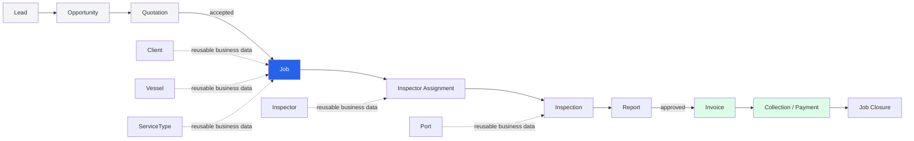

---

## Identity & Access

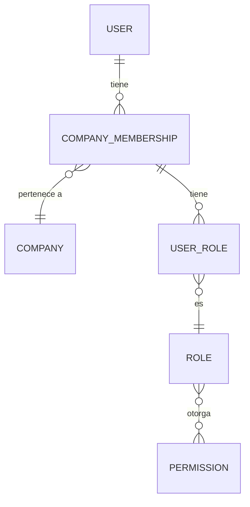

## Organization

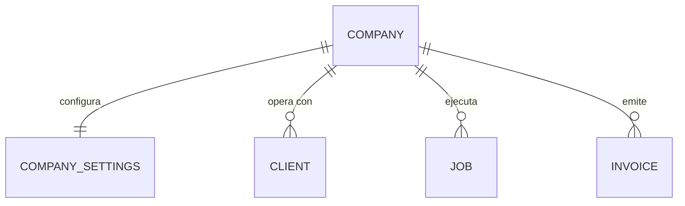

## Commercial

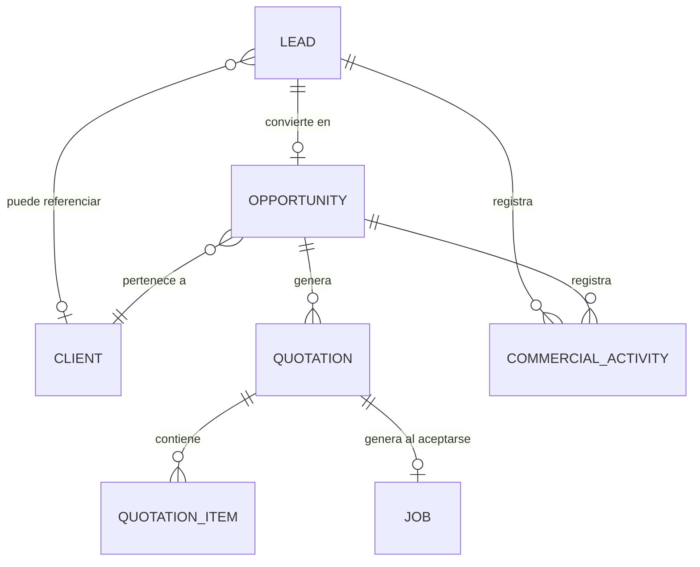

## Business Data

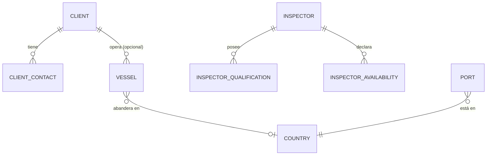

## Operations

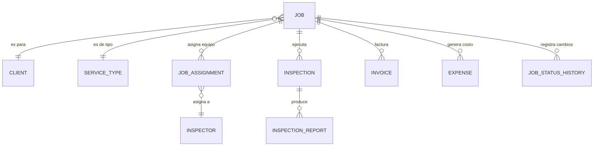

## Finance

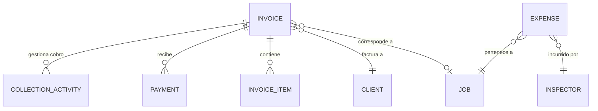

## Documents

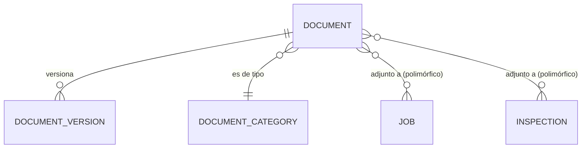

## Communications & Governance

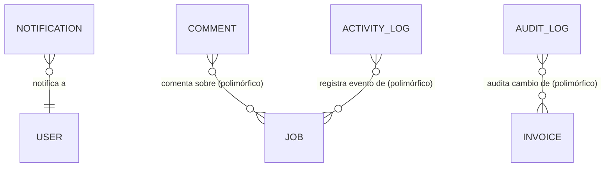

---

## Job Lifecycle — las 3 dimensiones de estado

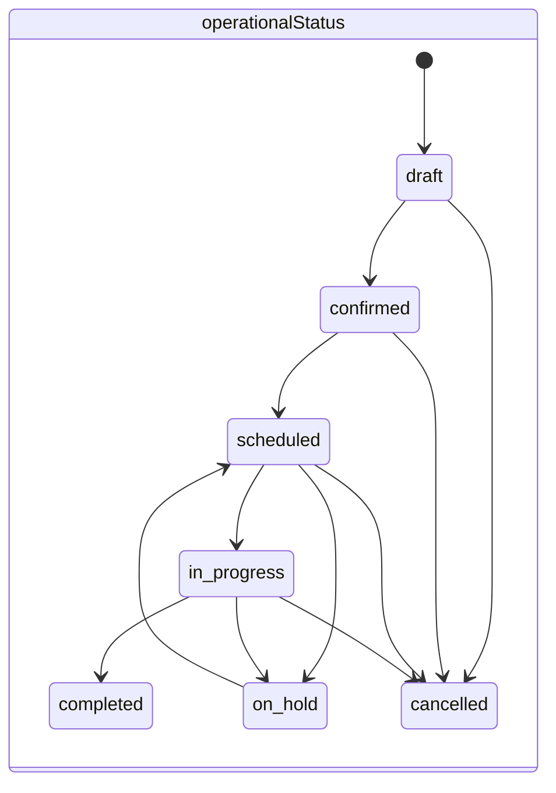

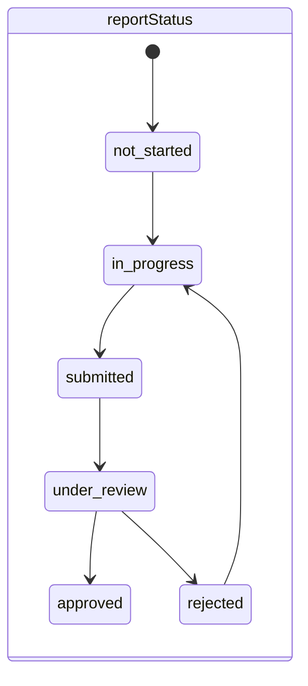

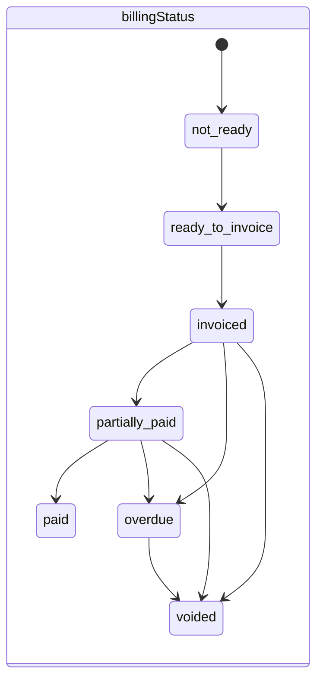
