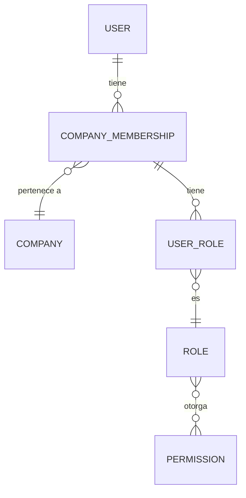
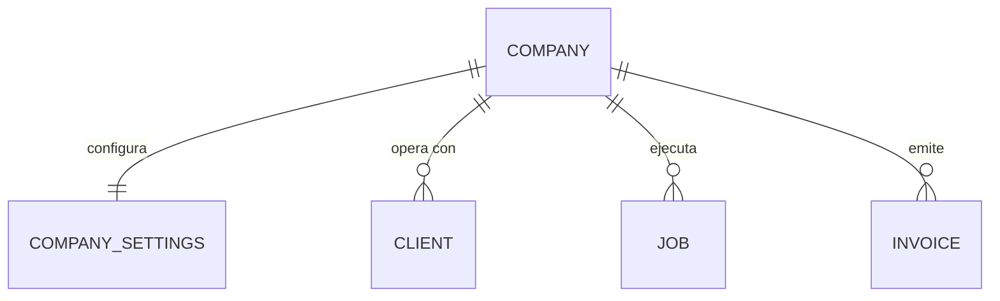
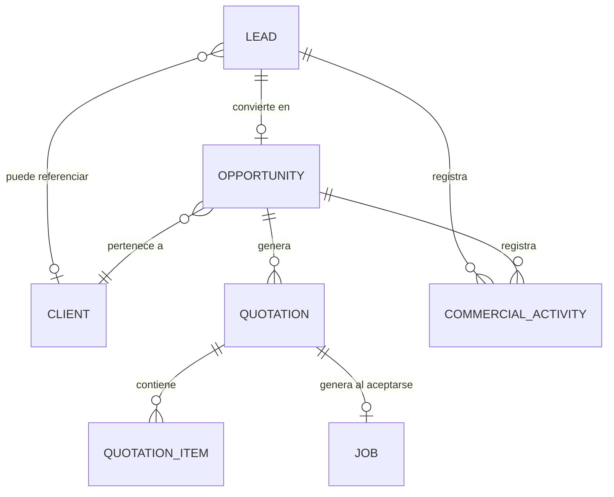
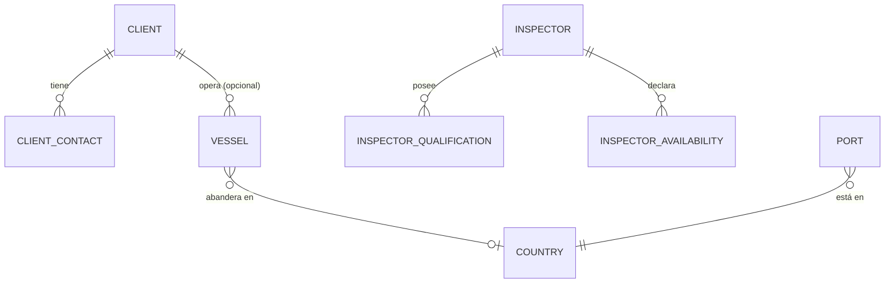
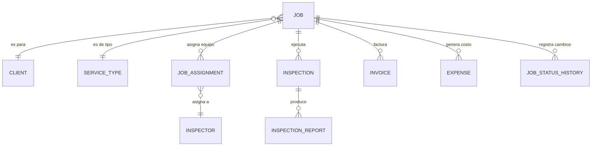
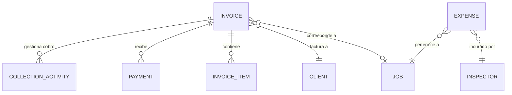
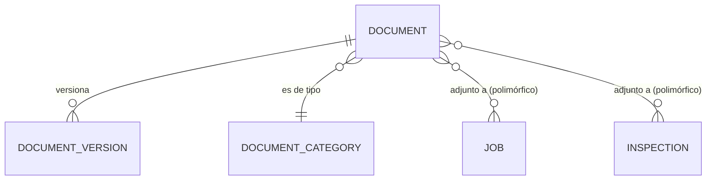
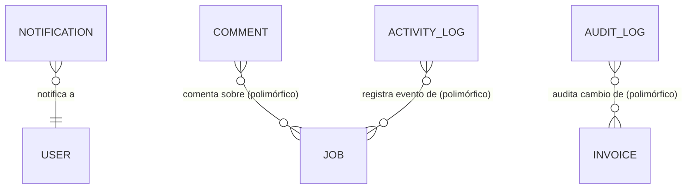

# Relationships

Cardinalidades entre entidades, agrupadas por bounded context, con un diagrama Mermaid por contexto. El diagrama general simplificado y la vista consolidada de todos los diagramas viven en [diagrams.md](./diagrams.md).

Notación de cardinalidad: `1—1`, `1—N`, `N—1`, `N—M`. Todas las relaciones son por ID (ver convención en [README.md](./README.md)) — ninguna entidad anida objetos completos de otra.

---

## Identity & Access

| De | A | Cardinalidad | Notas |
|---|---|---|---|
| User | CompanyMembership | 1—N | un User puede pertenecer a varias Company |
| CompanyMembership | Company | N—1 | |
| CompanyMembership | UserRole | 1—N | permite múltiples roles por membership |
| UserRole | Role | N—1 | |
| Role | Permission | N—M | vía matriz conceptual, no tabla propia en esta fase |

---

## Organization

| De | A | Cardinalidad | Notas |
|---|---|---|---|
| Company | CompanySettings | 1—1 | |
| Company | Client / Job / Quotation / Invoice / Expense / Document | 1—N | ver tabla multiempresa en domain-overview.md |

---

## Commercial

| De | A | Cardinalidad | Notas |
|---|---|---|---|
| Lead | Client | 0..1—1 | opcional, si ya existía el cliente |
| Lead | Opportunity | 0..1—1 | un Lead genera como máximo una Opportunity al convertirse |
| Opportunity | Client | N—1 | |
| Opportunity | Quotation | 1—N | puede tener varias cotizaciones/revisiones |
| Quotation | QuotationItem | 1—N | |
| Quotation | Job | 0..1—1 | una Quotation `accepted` puede generar como máximo un Job |
| Lead / Opportunity | CommercialActivity | 1—N | polimórfico |

---

## Business Data

| De | A | Cardinalidad | Notas |
|---|---|---|---|
| Client | ClientContact | 1—N | |
| Client | Vessel | 1—N | armador/operador habitual (opcional) |
| Inspector | InspectorQualification | 1—N | |
| Inspector | InspectorAvailability | 1—N | |
| Port | Country | N—1 | |
| Vessel | Country | N—1 | bandera, opcional |

---

## Operations

| De | A | Cardinalidad | Notas |
|---|---|---|---|
| Job | Client | N—1 | |
| Job | ServiceType | N—1 | tipo principal |
| Job | JobAssignment | 1—N | equipo asignado al Job completo |
| Job | Inspection | 1—N | ver decisión Job vs Inspection en domain-overview.md |
| Job | Invoice | 1—N | normalmente 1, excepcionalmente varias |
| Job | Expense | 1—N | |
| Job | JobMilestone | 1—N | |
| Job | JobStatusHistory | 1—N | |
| Job | OperationalNote | 1—N | |
| JobAssignment | Inspector | N—1 | |
| Inspection | InspectionReport | 1—N | normalmente 1, puede tener varias versiones/revisiones |
| Inspection | Vessel / Port | N—1 (c/u, opcional) | por defecto hereda del Job |

---

## Finance

| De | A | Cardinalidad | Notas |
|---|---|---|---|
| Invoice | Client | N—1 | |
| Invoice | Job | 0..1—1 | normalmente presente, ver excepción documentada en entity-catalog.md |
| Invoice | InvoiceItem | 1—N | |
| Invoice | Payment | 1—N | pagos parciales |
| Invoice | CollectionActivity | 1—N | |
| Expense | Job | N—1 | |
| Expense | Inspector | N—1 | |

---

## Documents

| De | A | Cardinalidad | Notas |
|---|---|---|---|
| Document | DocumentVersion | 1—N | |
| Document | DocumentCategory | N—1 | |
| Document | (Job \| Inspection \| Inspector \| Client \| InspectorQualification \| ...) | N—M | polimórfico, vía `DocumentLink` conceptual |

---

## Communications & Governance

| De | A | Cardinalidad | Notas |
|---|---|---|---|
| Notification | User | N—1 | |
| Comment | (cualquier entidad) | N—1 | polimórfico |
| ActivityLog | (cualquier entidad) | N—1 | polimórfico |
| AuditLog | (cualquier entidad) | N—1 | polimórfico |

